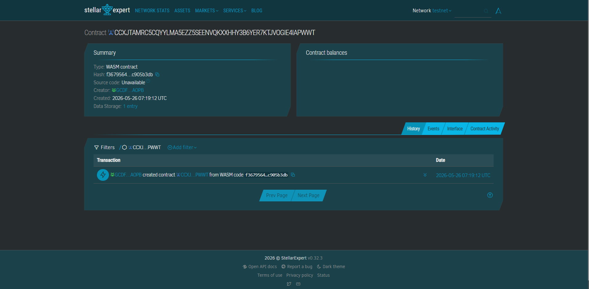

# BarangayRent Safe

Rental escrow protection for tenants and landlords using Stellar.

---

## Problem

Students and low-income renters lose security deposits because informal rental agreements rely on cash payments without transparent records.

## Solution

BarangayRent Safe uses Soroban escrow contracts to securely hold rental deposits and automatically release payments after verified move-out conditions.

---

## Timeline

Week 1:
- Smart contract development

Week 2:
- Rental agreement UI

Week 3:
- Wallet integration + QR flow

Week 4:
- Testnet deployment and demo

---

## Contract ID
CCXJTAMRC5CQYYLMA5EZZ5SEENVQKXXHHY3B6YER7KTJVOGIE4IAPWWT

## Contract Link
https://stellar.expert/explorer/testnet/contract/CCXJTAMRC5CQYYLMA5EZZ5SEENVQKXXHHY3B6YER7KTJVOGIE4IAPWWT




## Stellar Features Used

- Soroban Smart Contracts
- Stable Asset Transfers
- Trustlines
- XLM Fees

---

## Vision and Purpose

Create transparent and affordable rental escrow systems for underserved housing markets.

---

## Prerequisites

- Rust
- Soroban CLI
- Stellar testnet wallet

Install CLI:

```bash
cargo install soroban-cli
